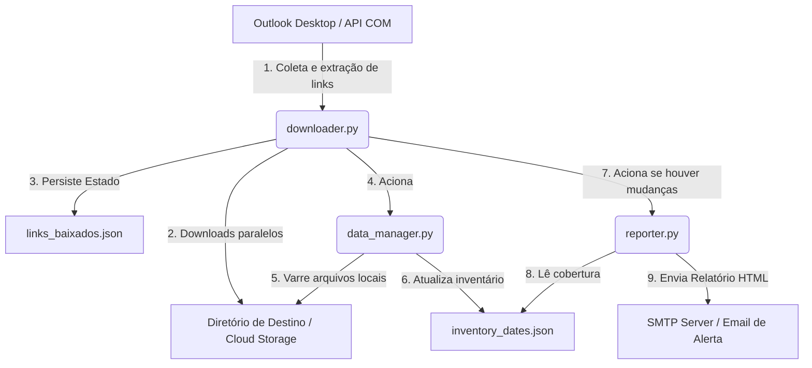

# 📧 automacao-emails

Um robô de Automação de Processos Robóticos (RPA) robusto e resiliente desenvolvido em Python para automatizar a leitura de e-mails, extração de links de download (como URLs pré-assinadas do Amazon S3), download concorrente de relatórios, catalogação de cobertura de dados e envio de relatórios consolidados de auditoria.

> [!NOTE]
> Esta documentação descreve a arquitetura geral e o funcionamento da solução de automação de e-mails de relatórios para fins de divulgação e implantação genérica.

---

## 🏗️ Arquitetura do Sistema

A solução foi projetada de forma modular para separar as preocupações de ingestão, indexação de dados, tratamento de datas internas e geração de relatórios de auditoria/SLA.



### Módulos Principais

| Componente | Script | Função Principal |
| :--- | :--- | :--- |
| **Configuração** | `config.py` | Fonte única de verdade. Centraliza expressões regulares, padrões de e-mail, mapeamentos de pastas locais e limites de SLA. |
| **Ingestão** | `downloader.py` | Motor de conexão MAPI (`pywin32`) com o Outlook, extração de URLs pré-assinadas via Regex, download concorrente (`ThreadPoolExecutor`) e controle anti-duplicados. |
| **Inventário** | `data_manager.py` | Indexador que varre as pastas de destino, detecta arquivos baixados e atualiza a base de dados de cobertura de datas. |
| **Validador de Datas**| `detector_datas.py` | Utilitário que lê o interior de planilhas CSV/XLSX para extrair a data real dos registros internos, garantindo que o arquivo seja nomeado com a data dos dados e não do e-mail. |
| **Relatórios** | `reporter.py` | Analisador de SLA que calcula eventuais atrasos (ex: D-1, D-2), monta um painel HTML de auditoria e envia notificações por e-mail (SMTP). |

---

## 🚀 Principais Funcionalidades & Resiliência

*   **Deduplicação de Downloads:** Utiliza um arquivo de estado (`links_baixados.json`) para registrar assinaturas de links já baixados, impedindo que a automação gaste banda reprocessando e-mails antigos.
*   **Detecção de Travamento do Outlook (COM Hang):** Se o Outlook Desktop demorar mais de 5 segundos para responder via API MAPI/COM, a automação finaliza os processos travados (`OUTLOOK.EXE`) de forma limpa e reinicia o aplicativo para evitar interrupções.
*   **Lookback de SLA Contínuo:** Calcula falhas de recebimento de relatórios considerando fins de semana e feriados para auditoria de SLA precisa.
*   **Recuperação de Emergência (`[RECOVERY]`):** Permite reprocessar relatórios em atraso a partir de e-mails encaminhados manualmente com o título contendo a tag `[RECOVERY]`.
*   **Consolidação de Histórico e Limpeza de Diários:** Script integrado para transferir registros de arquivos diários para planilhas de histórico consolidado em meses fechados, limpando arquivos antigos do armazenamento de forma segura.
*   **Escrita Atômica de Estado:** Gravações de arquivos JSON de estado utilizam escrita temporária (`.tmp`) seguida de substituição atômica, eliminando riscos de arquivos corrompidos em caso de falha de energia ou interrupção repentina.
*   **Prevenção de Execução Concorrente:** Mecanismo de lockfile (`.coletor.lock`) que garante que duas instâncias do robô não rodem ao mesmo tempo.

---

## 📅 Regras de Coleta e SLA (Exemplo de Configuração)

A automação pode ser configurada para tratar os relatórios conforme a frequência e a regra de nomenclatura ideal:

| Categoria | Frequência | Janela de Busca no E-mail | Regra de Data no Arquivo | SLA Alvo |
| :--- | :--- | :--- | :--- | :--- |
| **Consolidados** | Diária | Mês Atual + Anterior | Data interna lida da planilha | **D-2** |
| **Operacionais** | Diária | Backfill Total | Data interna lida da planilha | **D-1** |
| **Snapshots** | Semanal / Mensal | Backfill Total | Data de recebimento do e-mail | Frequência Real |

---

## ⚙️ Configuração e Execução

### Requisitos Mínimos
*   Sistema Operacional: Windows (devido à integração COM com o Outlook Desktop)
*   Python 3.8+
*   Microsoft Outlook instalado e configurado com a conta corporativa alvo

### Instalação de Dependências
```bash
pip install requests beautifulsoup4 pywin32 pandas openpyxl
```

### Variáveis de Ambiente (`.env`)
Crie um arquivo `.env` na raiz do projeto para configurar as credenciais de envio de relatório SMTP:
```env
SMTP_EMAIL_USER=seu-email-alerta@dominio.com
SMTP_EMAIL_PASS=sua-senha-de-aplicativo
```

### Execução
Para executar o ciclo completo manualmente com uma janela de busca padrão de 30 dias:
```bash
python downloader.py --days 30
```

Para produção, utilize o script orquestrador de lote que garante a abertura e estabilização corretas da interface do Outlook:
```cmd
Executar_Coletor.cmd
```

---

## 📝 Tratamento de Erros Comuns

*   **Lock ativo detectado:** Se a automação anterior foi interrompida de forma abrupta, delete o arquivo `.coletor.lock` manualmente.
*   **Erro HTTP 403 (Forbidden):** Links pré-assinados da AWS geralmente expiram após 72 horas. O robô detecta e ignora links antigos expirados para evitar loops de erro.
*   **Erro de Conexão COM do Outlook:** Certifique-se de que o Outlook Desktop está aberto e totalmente atualizado e que o script de lote foi utilizado para iniciar.
